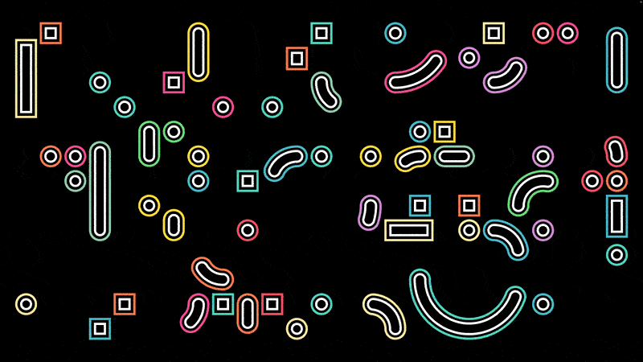

# Kinogrida

A macOS screen saver featuring animated geometric shapes — arcs and rounded squares — moving across a grid with smooth transitions and automatic palette changes.
Ported from the [Kinogrida web project](https://github.com/Amphore-Dev/Kinogrida) (TypeScript/Canvas) to native Swift.

## Features

- Procedurally generated grid of arcs and squares
- Automatic palette change every 2 minutes with a fade transition
- 5 color palettes, randomly selected

## Installation

1. Download `Kinogrida.saver` from [Releases](https://github.com/Amphore-Dev/Kinogrida-screensaver/releases)
2. Double-click the file — macOS will install it automatically
3. Open **System Settings → Screen Saver** and select Kinogrida

## Build from source

```
git clone https://github.com/Amphore-Dev/Kinogrida-screensaver.git
open Kinogrida.xcodeproj
```

Build the `Kinogrida` scheme. The `.saver` bundle is installed to `~/Library/Screen Savers`.

## Requirements

macOS 11.5 or later
